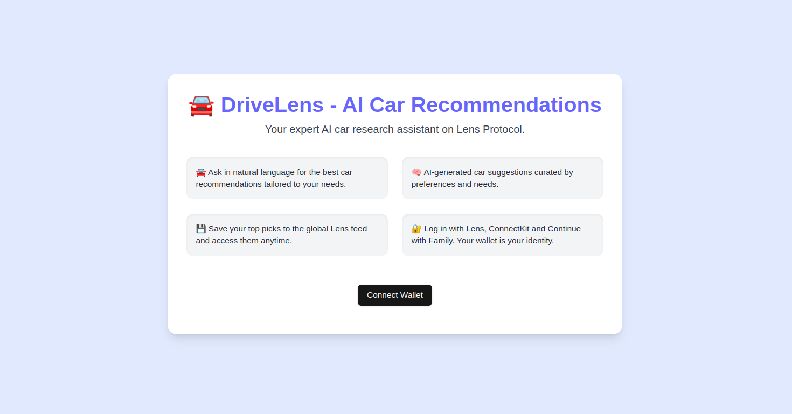

# 🚘 Drivelens - AI Car Recommendations on Lens Protocol

**Your intelligent car research assistant meets Web3.**  
Built for the [Lens Spring Hackathon](https://lens.xyz/news/lens-spring-hackathon), this project combines AI agents with the social power of the Lens Protocol to create a personalized, interactive, and shareable research experience. Whether you're just curious or seriously in the market, this AI agent helps you explore, discover, and share car recommendations seamlessly — powered by your wallet.

---


## 🌟 What is This?

DriveLens is a **next-generation social research app** powered by **CrewAI agents**, **CopilotKit**, and the **Lens Protocol**. It allows users to:

- Ask **natural language questions** about cars ("What are the best hybrid SUVs under $30k?")
- Get **AI-curated vehicle recommendations** using real-time web search tools
- Dive into **detailed AI-generated car reviews**
- **Log in with Lens** and post findings to a **custom feed**, forming a discoverable and evolving social knowledge base
- Retain privacy and identity through **wallet-based authentication**

This isn’t just a car research tool — it’s a new type of **AI-powered Lens-native social platform** where posts are valuable research artifacts, not fleeting content.

---
[Chat Features](images/drivelens.png)

## 🚀 Features

### 🤖 AI-Driven Car Research
Ask your questions in plain English, and let our CrewAI-powered assistant handle the search, reasoning, and summaries. Get direct, accurate, and intelligent answers.

### 🧠 Deep Dive Reviews
Want more info on a specific car? Just ask. The agent will perform a targeted review using the latest web data and AI summarization.

### 💬 Personalized Feed on Lens
Each user has a Lens-authenticated session. Your top picks can be shared with the Lens community, enabling **social search** and **feed-based discovery**.

### 💾 Web3 Identity + Monetization Potential
Users log in via **Lens/ConnectKit**, using their wallet as identity. This opens up future monetization:
- Token-gated research access
- Tipping expert researchers
- Feed monetization via branded content or referral links

---

## 🛠 Tech Stack

| Layer       | Technology                                               |
|------------|----------------------------------------------------------|
| Frontend    | Next.js, React, TypeScript, CopilotKit SDK              |
| Backend     | Python, CrewAI, LiteLLM, Tavily                         |
| LLM Access  | OpenRouter (GPT-4o, DeepSeek), optionally OpenAI        |
| Tools       | Tavily Search API, Custom Deep Dive Tool               |
| Identity    | Lens Protocol, ConnectKit + Family      |
| Hosting     | Fully deployable frontend/backend structure             |

---

## 🗂 Project Structure

- `agent/` Python-based CrewAI agent backend
- `ui/` Next.js + CopilotKit frontend app with Lens integration
- `README.md`


---

## 🔑 API Keys Required

### Frontend (`ui/.env`)
```env
OPENROUTER_API_KEY=           # For calling LLMs via OpenRouter
NEXT_PUBLIC_APP_ADDRESS=      # Your Lens app address
NEXT_PUBLIC_ENVIRONMENT=      # e.g., "development" or "production"
NEXT_PUBLIC_WALLETCONNECT_PROJECT_ID=  # From WalletConnect
```

### Backend (`ui/.env`)
```env
OPENROUTER_API_KEY=           # Required for LiteLLM and CrewAI
TAVILY_API_KEY=               # Used for real-time car search
```

## 🚀 Setup and Installation
### Clone the Repository

```
git clone https://github.com/ofemeteng/ai-car-rec
cd ai-car-rec
```

## Backend (Python CrewAI Agent)

```cd agent
poetry install
poetry shell
# Add your .env with OPENROUTER_API_KEY and TAVILY_API_KEY
python -m main
```

## Frontend (Next.js App)

```cd ui
pnpm install
# Add your .env with the 4 frontend env vars
pnpm run dev
```

## 🌐 Access the App

Once both servers are running:

- **Frontend:** [http://localhost:3000](http://localhost:3000)
- Interact with the assistant right away.
- Connect your Lens wallet to unlock full functionality and publish posts.

---

## 🤔 How Does It Work?

1. **User Logs In:** Authenticates via Lens Protocol using ConnectKit.  
2. **User Asks a Question:** Example: _"Best electric SUVs under $40k?"_  
3. **Agent Triggers a Search Tool** via Tavily API.  
4. **Results Are Structured** into intelligent recommendations.  
5. **Follow-Up?** Agent asks if you’d like a deeper review of a specific car.  
6. **User Shares** the best results to their Lens feed.


## 🛠️ CrewAI Flow Highlights

Flows are defined in `agent/main.py` using `@start`, `@router`, and `@listen`.

- 🔍 **Search tool** provides car discovery.  
- 📄 **Deep Dive Review tool** offers detailed car writeups.  
- ⚡ **Uses CopilotKit** for streaming and UI-state binding.

---

## 📱 UI/UX Highlights

The landing page includes:

- 👨‍🔧 **Login via Lens and Family**  
- 🚘 **Car recommendation samples**  
- 💾 **Save-to-feed mechanism**  
- 📦 **Clean, responsive UI** with TailwindCSS and component reuse

---

## 🧩 Why Lens Matters

This app leverages Lens in a novel way:

| Traditional Use      | This App Does                       |
|----------------------|-------------------------------------|
| Short posts          | Rich research artifacts             |
| Likes/comments       | Community-driven review curation    |
| Profiles             | Reputation for intelligent queries  |
| Monetization TBD     | Future potential for tipping experts |


### 🧠 Prompt Logic

- Avoids repetitive questions  
- Optimized for step-wise car selection  
- Handles follow-up requests with tool routing

---

## 🧪 Example Queries

- _"What's the safest electric car for a family of 5?"_  
- _"Compare the Toyota RAV4 and Honda CR-V."_  
- _"Tell me more about the Hyundai Ioniq 6."_

---

## 📣 Future Plans

- 💸 **Monetization via Lens** — Users can offer paid reviews or insights as Lens posts/NFTs  
- 📦 **Affiliate Integration** — Link out to marketplaces with embedded partner revenue  
- 📊 **Community Trends** — Show what cars are trending across the Lens feed  
- 🎯 **Fine-tuned Models** — Train models on car specs, reviews, and user preferences for hyper-targeted results

---

## 🙌 Acknowledgements

- Built for the **Lens Spring Hackathon**  
- AI agents powered by **CrewAI + CopilotKit**  
- Thanks to **OpenRouter, Tavily, ConnectKit,** and the **Lens ecosystem**

---

## 🏁 Final Thoughts

**DriveLens** bridges the gap between intelligent search and decentralized social content.

It’s not just about finding the perfect car—it’s about **building a community where discovery is AI-powered, content is user-owned, and conversations are stored on-chain.**

Built with 💜 for the **Lens Spring Hackathon**.
